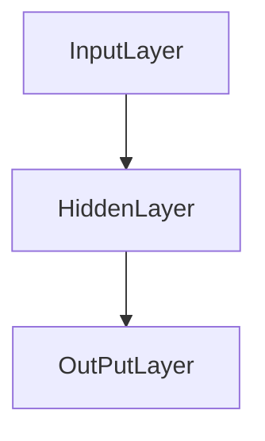

>[!WARNING]
> This a Basic

This is like a evidence that I like trainer a Neuronal  ***Machine Learning***
I can make a three sections about a Machine Learning

  When I could see like a Structure from Nodes

## Where I can Use Machine Learning

- For Continually Change Environments :

>[!TIP]
Like... The Fucking BOT
## And Cases When I could use Deep Learning

- NPL (Natural Language Processing)
- seq2seq (Sequence to Sequence)